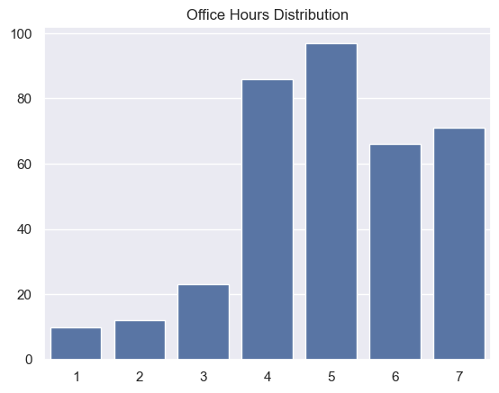
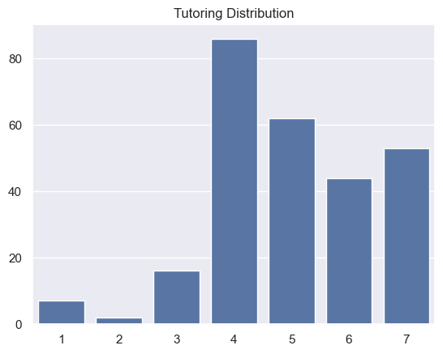
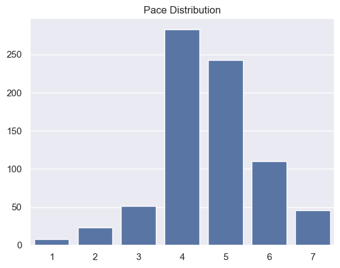
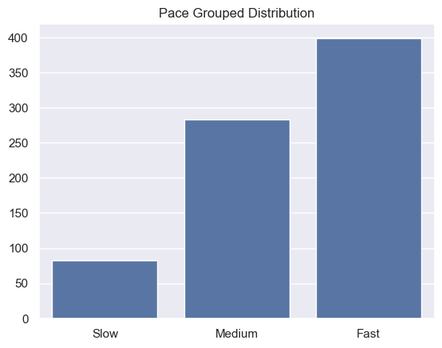

---
# Do not edit the text between these lines!
layout: default
---

# Comp110 Ex09 Test

<!-- This is a comment. Below, you'll see code for inserting an image. To make this image appear, update <custom-path>. To add an image, save it inside the imgs folder of this repository. -->

## Brainstorming Possible Course Improvements

After taking the class during the fall semester and acting as a TA during the Spring, I decided to focus on my experience and later see how it aligned with the data. The following are five unexplored ideas of how the course could be modified in the following semester. 

1. The course should provide opportunities for deeper exploration to students who want it because, while some students may be there to fulfill a requirement, others may want to learn more beyond what is strictly necessary to pass the course.
2. The course should avoid reviewing previous concepts in gory detail in class, such as memory diagrams, because office hours, tutoring, and practice questions already exist for students who need the additional review. 
3. The course should have more opportunities for code writing during lecture because this is one of the hardest but most important skills to be developed in this class.
4. The course should incorporate recursion into more assignments since many students find it to be the most difficult concept to understand. 
5. The course should include real-world examples to because new concepts can seem abstract and useless until examples are shown. 

Idea two is the best one to analyze for this assignment since there is available data which could be used to support or refute it. These data are: oh_effective, tutoring_effective, and pace. 

## Getting the Data
First we want organize our data so we're only working with the pieces that are useful to us. We can grab the data from Alyssa's survey and Izzi's survey using columnar and read_csv_rows, then combine that into one table with the concat function. Then we'll create a new dataset with only the three variables we're interested in using the select function. Last, we'll use head to double check out data looks correct, and display the results with tabulate. 

## Manipulating the Data
Using counts, we can count the number of responses for each rating from 1-7. This is helpful, but can be difficult to immediately parse. 

I created a helper function called pace_filter. This works very similarly to count: it count how many responses are less than 4, equal to 4, and greater than 4, then returns those numbers in a list. Since pace was rated on a scale of 1-7, with 1 being very slow and 7 being very fast, 4 should be the happy medium.

Here's the output:
Slow: 82
Medium: 283
Fast: 399

pace_counts: {'4': 283, '6': 110, '2': 23, '5': 243, '7': 46, '3': 51, '1': 8}
oh_counts: {'': 399, '5': 97, '7': 71, '6': 66, '4': 86, '3': 23, '1': 10, '2': 12}
tutoring_counts: {'': 494, '6': 44, '7': 53, '4': 86, '5': 62, '3': 16, '1': 7, '2': 2}

That's not very organized right now. It needs to be put into an intelligible format. 

## Visualizing the Results
Let's visualize the data with seaborn to understand what it means. I created a bar plot for each distribution, ordered the x-axis numerically, and changed the titles so I knew which was which. Then, I created a chart for pace using the slices of slow, medium, and fast. 

## Analysis
The most common response for pace was 4. This means many students find the course to be reasonably paced. 5 was a close second. The grouped distribution shows us that over four times as many students rated the course to be fast rather than slow.

The most common response for oh_effective was 5. This means that many students find office hours to be largely helpful. The bar plot displays similarly high counts for 4, 6, and 7, and significantly lower counts for 1, 2, and 3, which means that the vast majority of students get high value out of office hours.

The most common response for oh_effective was 4. This means that many students find tutoring to be somewhat helpful. The bar plot displays somewhat high counts for 5, 6, and 7, and lower counts for 1, 2, and 3, which means that the vast majority of students get value out of tutoring.

## Conclusion
The analysis doesn't support my idea to move the course faster. The majority of responding students found the course to be either reasonably paced or too fast, which is the complete opposite of what my idea is based off of. It's hard to say exactly *why* students find the course to be too fast. It may be unrelated to my proposal that there's too much review. However, until we know more, it's not reasonable to continue with my idea. 

The data do show that students are benefitting from office hours and tutoring. This is still useful to know: it means that the support systems in place are effective. The follow-up question is why office hours and tutoring are effective, and why students rated office hours to be more effective than tutoring overall. What kinds of questions/problems do they bring to the two support systems? What do the TAs do that helps?

My proposed change could have several negative consequences if implemented as I described. First, it would accelerate the pace of the course. Since the majority of students do not find it to be too slow, they may struggle to keep up if this is implemented. Second, pushing review/practice into independent work may cause an associated increase in visits to office hours/tutoring, which could overload the capacity and reduce their effectiveness. Thirdly, if the introductory programming course is too inaccessible, prospective computer science majors and minors may be discouraged and choose to pursue something else when they would've enjoyed computer science otherwise. 